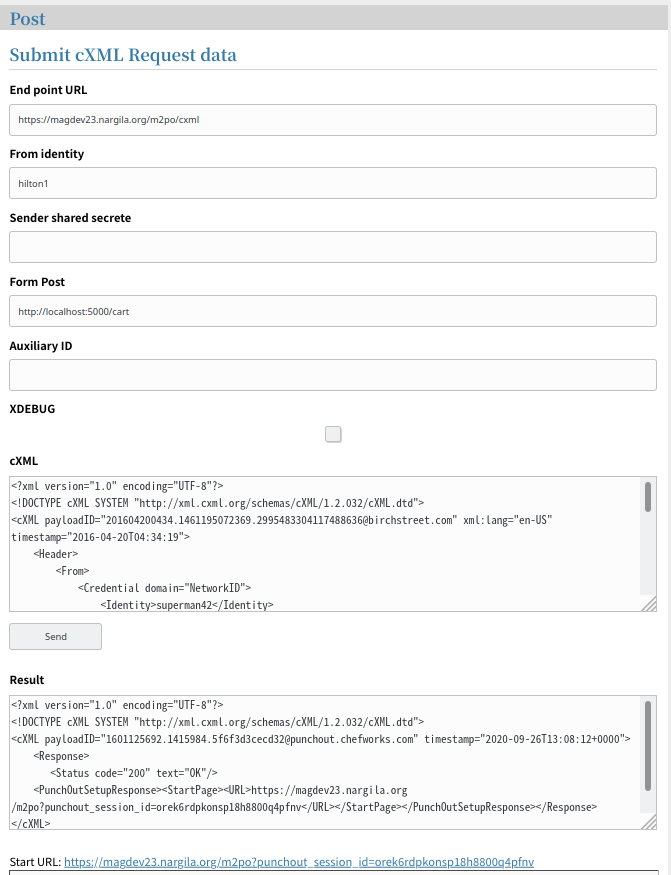

# cxml-tester
[](https://github.com/chefworks/cxml-tester)

cxml-tester's purpose is to test Punchout Providers implementations.

How it works: cxml-tester provides a web UI for posting cXML data to end-points.
While the same - and more - can be acheived with `curl`, cxml-tester has a nicer UI.
----

----
see [cXML Reference Guide](http://xml.cxml.org/current/cXMLReferenceGuide.pdf) for general
infromation about the cXML protocol and syntax

## Running locally
### Requirements
- make
- python3
- docker

### Run

```
make init
make run
```

Then go to http://localhost:8080


## Running using docker

```
docker run -d -p 8080:8080 chefworks/cxml-tester
```
